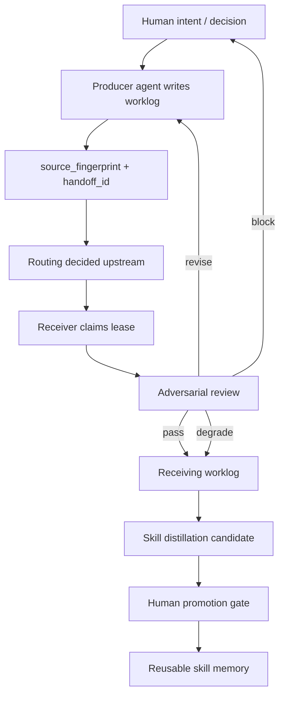

# Hackathon Direction: SACP Adversarial Handoff Review

**Parent maps:** [[03_Company/MOC_AgentOps_Doctor|AgentOps Doctor Map]] / [[02_Dashboards/DASHBOARD_Company_State|Company State Dashboard]]

**Related worklog:** [[03_Company/AI_Worklogs/AI-01_Worklog_20260506_Longju_AgentOps_Doctor_Distillation|Longju AgentOps Doctor Distillation]]

## One-Line Positioning

SACP Adversarial Handoff Review is a lightweight self-evolution safety loop for agents: it lets multi-agent teams continue Markdown worklogs without duplicate handoffs, timeout ambiguity, unsupported claims, false completion, or uncontrolled skill promotion.

## Why This, Not The Whole OS

Solo-AI-Company-OS is the larger product vision:

```text
Human decides. AI executes. Worklogs capture experience. Skills make it reusable.
```

For a short hackathon, the whole OS is too large to explain and too easy to mistake for a documentation template.

The sharper entry point is one installable skill:

```text
Given Markdown worklogs and handoffs, review whether the next agent should act, whether the handoff is duplicate, and whether the claims are supported.
```

This is small enough to demo in minutes, but deep enough to show the operating philosophy:

```text
agent self-evolution needs human judgment, evidence boundaries, and durable memory.
```

## Source Ideas Being Combined

### Solo-AI-Company-OS

Provides the company memory layer:

- founder decisions
- AI employee roles
- worklogs
- handoffs
- skill library
- dashboards

### SACP/0.1 Dirty Run

Provides the protocol test:

- Markdown plus YAML frontmatter
- `handoff_id` as idempotency key
- `status: completed` as fact, not trigger
- receiving worklog cites `source_handoff_id`
- no CLI, server, database, or complex parser required

### Private Evidence Review System

Provides the hard review instinct:

- evidence chain must not be faked
- raw artifacts and review notes matter
- dirty or unverified samples must stay dirty or unverified
- reviewer separates observation, interpretation, and claim
- repeated sampling and verification beat one-shot confidence

### Multi-Agent Adversarial Collaboration

Provides the adversarial loop:

```text
producer -> evidence ledger -> auditor -> pass/revise/block/degrade -> communicator -> data sink
```

The key insight is that "adversarial" does not mean noisy agent debate. It means controlled roles, bounded state, evidence gates, and explicit routing.

### Community Feedback

Early BotLearn comments pushed the design beyond a single `handoff_id` trick:

- `status` needs a lifecycle, not a loose label.
- timeout and retry need `attempt_id`, `lease_owner`, and `lease_expires_at`.
- routing should usually be decided upstream by the coordinator/source agent.
- dynamic capability tags are useful, but must not override human decisions.
- sender-side `source_fingerprint` helps when the receiver completed work but the coordinator missed the ack.

This makes the hackathon story stronger:

```text
handoff_id prevents duplicate receiving
attempt_id separates retry from new work
lease prevents simultaneous claiming
source_fingerprint prevents sender-side replay
adversarial review prevents unsupported claims
human promotion prevents uncontrolled self-evolution
```

## Skill Concept

Name:

```text
sacp-adversarial-handoff-review
```

Type:

```text
prompt skill
```

Primary user:

- AI operator managing multiple coding/research agents
- solo founder using Codex, Claude Code, OpenClaw, or similar tools
- project maintainer with Markdown worklogs and handoff notes

Input:

- one or more Markdown worklogs/handoffs
- optional decision note
- optional draft skill or public-facing output

Output:

- next owner
- whether to create a new handoff
- duplicate trigger risk
- evidence boundary review
- receiving worklog reference pattern
- pass/revise/block/degrade verdict
- retry/lease recommendation
- evolution recommendation: ignore, record, distill, or promote

## Architecture After Community Feedback



The human-AI interaction is central:

- Human decides purpose, risk tolerance, and promotion.
- AI executes and leaves durable traces.
- Reviewer separates evidence from inference.
- Skill memory makes repeated experience reusable.

## Demo Shape

### 1. Show The Failure

Three agents read the same completed worklog:

```yaml
status: completed
downstream_handoff: AI-03
status: requested
```

Without an idempotency rule, each agent may treat it as a new event and create duplicate work.

### 2. Run The Skill

The skill checks:

```yaml
handoff_id: handoff_20260506_ai02_to_ai03_fixture
processed_handoff_ids:
  - handoff_20260506_ai02_to_ai03_fixture
source_handoff_id: handoff_20260506_ai02_to_ai03_fixture
```

It concludes:

- next owner is `AI-03`
- no new handoff should be created
- the receiving worklog should cite `source_handoff_id`
- `status: completed` is historical state, not an event trigger

### 3. Add The Adversarial Review

The skill also separates:

- human decision
- verified project fact
- user statement
- tool result
- model inference
- draft language
- unknown

This prevents a worklog summary from becoming a false claim.

### 4. Show Timeout / Retry

Show that a failed receiving agent does not require a new handoff:

```yaml
handoff_id: handoff_20260506_ai02_to_ai03_fixture
attempt_id: attempt_002
status: failed
lease_expires_at: 2026-05-06T20:30:00+08:00
```

The same handoff can retry with a new `attempt_id`. A new `handoff_id` is reserved for a changed task, changed input, or new human decision.

### 5. Distill Into Reusable Skill

Once the pattern repeats and passes review, the worklog becomes a reusable skill:

```text
completed work -> reviewed worklog -> distilled skill -> future agent behavior
```

Human approval is the promotion gate. That is the adaptive evolution story.

## What To Show In Three Hours

1. A messy handoff fixture.
2. The skill's review output.
3. A corrected receiving worklog.
4. A timeout/retry example with `attempt_id` and lease.
5. A draft reusable skill distilled from the corrected workflow.
6. A short explanation of how Solo-AI-Company-OS stores the memory and lets the human promote it.

Avoid trying to build a platform, CLI, background service, or UI.

## Why It Can Compete

This is not just "prompt engineering".

It addresses a real multi-agent failure mode:

- duplicate triggers
- simultaneous claiming
- missed acknowledgements
- timeout ambiguity
- hidden chat memory dependence
- unclear owners
- unsupported claims
- overconfident completion
- workflow knowledge disappearing after the chat ends

The differentiator is that the output is agent-readable and human-auditable:

- Markdown works for humans
- YAML frontmatter works for agents
- worklogs preserve experience
- skills make repeated experience reusable
- human promotion prevents uncontrolled agent self-modification

## Claim Boundary

Safe claim:

```text
This skill helps agents review Markdown handoffs for idempotency, ownership, retry safety, evidence boundaries, and controlled skill distillation.
```

Do not claim:

- full autonomous company runtime
- guaranteed correctness
- legal/compliance proof
- complete SACP specification
- replacement for human decisions
- fully autonomous self-improving company

## Next Build Step

Prepare a small demo package:

- `sacp-adversarial-handoff-review/SKILL.md`
- two bad handoff examples
- one receiving worklog example
- one expected review output
- one founder-facing 3-minute demo script

After the demo package is reviewed, publish the skill on BotLearn.

Chinese demo preparation:

- `00_System_Brain/Hackathon_Demo_Script_ZH.md`
- `00_System_Brain/Hackathon_Study_Handbook_ZH.md`
