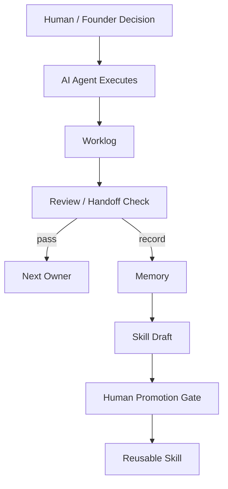

# 架构深讲：从聊天机器人到 AI Company OS

## 1. 架构总览



人类不是被替代者。

人类是最终决策者。

AI 的角色是：

- 执行
- 留痕
- 审查
- 沉淀
- 起草可复用技能

## 2. 权威顺序

SACP 不能让 worklog 覆盖 founder decision。

权威顺序：

1. 最新人类明确指令
2. Founder decision
3. Verified project truth
4. Dashboard
5. Worklog / handoff
6. Skill
7. 历史聊天

这很重要。

否则 AI 可能把一次执行记录误当成公司战略。

## 3. 数据结构

SACP 文件由两部分组成：

```text
YAML frontmatter
Markdown body
```

frontmatter 负责机器读：

```yaml
type: worklog
protocol: SACP/0.1
id: worklog_20260506_ai02_fixture
agent_id: AI-02
status: completed
handoff_id: handoff_abc
```

body 负责人类读：

```markdown
## What Changed
AI-02 finished the boundary review and requested AI-03 to draft language.
```

## 4. 为什么幂等性是核心？

多 agent 系统里，同一文件可能被反复读取。

如果读取本身触发动作，就会出事故。

所以 SACP 必须把两件事分开：

```text
事实状态 != 触发事件
```

`status: completed` 只是事实。

它不能代表“每次读到都触发下一步”。

## 5. Handoff 状态机

```text
requested
  -> claimed
  -> processing
     -> completed
     -> failed
     -> expired
     -> blocked
     -> superseded
```

关键判断：

1. 有 receiving worklog 吗？
2. receiving worklog 的 `source_handoff_id` 匹配吗？
3. receiving worklog 的 `status` 是什么？
4. lease 是否过期？
5. 输入或 human decision 是否改变？

## 6. Retry 不是 New Task

如果任务没变：

```yaml
handoff_id: handoff_abc
attempt_id: attempt_002
```

如果任务变了：

```yaml
handoff_id: handoff_def
attempt_id: attempt_001
```

这个区别是给未来审计看的。

## 7. Adversarial Review 的作用

这里的 adversarial 不是吵架。

它是一个审查角色：

```text
这个结论有证据吗？
这个 owner 对吗？
这个 handoff 会不会重复？
这个 claim 是否越界？
这次经验是否值得沉淀？
```

它保护项目不被 AI 的流畅文字带偏。

## 8. Evidence Boundary

AI 输出要分层：

| 层级 | 意思 |
|---|---|
| human decision | 人类明确决定 |
| verified fact | 已验证事实 |
| tool result | 工具结果 |
| user statement | 用户陈述 |
| model inference | 模型推理 |
| draft language | 草稿文字 |
| unknown | 未知 |

不能把 model inference 写成 verified fact。

这条从私有审计复盘经验继承而来。

## 9. Skill Distillation

当一个流程反复有效时，AI 可以起草 skill。

但是：

```text
skill draft 不是正式能力。
promote 必须由人批准。
```

这让 self-evolution 有边界。

## 10. 为什么这是轻协议层？

SACP/0.1 不做：

- CLI
- server
- database
- scheduler
- complex parser

它只做：

- 可读字段
- 状态判断
- handoff 去重
- worklog 引用
- skill 晋升门禁

这叫轻协议。

## 11. 和现有工具的关系

| 工具 | 负责什么 |
|---|---|
| Codex / Claude Code | 执行和读写文件 |
| OpenClaw / BotLearn | agent 平台和 skill 生态 |
| Obsidian | 人类查看和导航 |
| SACP | 共享操作语义 |
| Solo-AI-Company-OS | 公司记忆层 |

SACP 不替代这些工具。

它让这些工具共享同一套工作记忆。

## 12. 未来扩展

Dirty Run 成立后，才考虑：

- 自动扫描 handoff
- dashboard 显示 owner
- worklog index
- skill library ranking
- release validator
- BotLearn skill 发布

但现在不要跳到重型路线。

## 13. 架构一句话

```text
SACP 是 AI 公司文件系统里的交通规则。
Solo-AI-Company-OS 是道路和仓库。
Agent 是车。
Founder 是方向盘。
```
