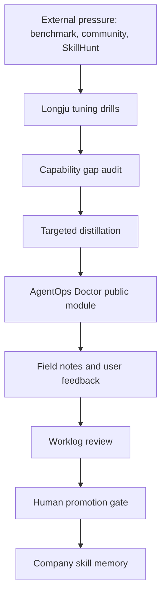

# MOC - AgentOps Doctor

**Purpose:** Navigate the AgentOps Doctor public module and its relationship to the larger AI Company OS.

**Parent maps:** [[03_Company/MOC_Company|Company Map]] / [[03_Company/MOC_AI_Employees|AI Employee Map]] / [[02_Dashboards/DASHBOARD_Company_State|Company State Dashboard]]

---

## Public Module

- [[agentops-doctor/README.zh-CN|AgentOps Doctor 中文 README]]
- [[agentops-doctor/README|AgentOps Doctor English README]]
- [[agentops-doctor/templates.zh-CN|Input Templates]]
- [[agentops-doctor/cases.zh-CN|Public Case Library]]
- [[agentops-doctor/field-notes-playbook.zh-CN|Field Notes Playbook]]
- [[agentops-doctor/demo-script-3min.zh-CN|3-Minute Demo Script]]

---

## Positioning

AgentOps Doctor is the first public diagnostic slice.

AI Company OS is the mother system.

Handoff Diagnosis is one module inside AgentOps Doctor, not the whole product.

```text
AI Company OS -> AgentOps Doctor -> Handoff Diagnosis
```

Core narrative:

```text
Human decides.
AI executes.
Worklogs remember.
Handoffs coordinate.
Skills evolve.
Markdown stays source of truth.
```

---

## Five Diagnostic Modules

| Module | Question It Answers | Typical Verdicts |
|---|---|---|
| Handoff Diagnosis | Should the next agent act on this handoff? | skip / wait / retry / rework / block |
| Worklog Audit | Is the worklog complete enough to trust or continue? | pass / needs evidence / dirty / blocked |
| Adversarial Claim Review | Are claims supported by evidence and bounded correctly? | pass / revise / soften / remove |
| Skill Evolution Gate | Should the lesson become reusable behavior? | ignore / record / distill / promote_candidate |
| Privacy / Public Rewrite | Can this be posted or published safely? | public-safe / internal-only / private / restricted |

---

## Distillation Chain



---

## Related Worklogs

- [[03_Company/AI_Worklogs/AI-01_Worklog_20260506_Longju_AgentOps_Doctor_Distillation|Longju AgentOps Doctor Distillation]]
- [[03_Company/AI_Worklogs/worklog_20260506_longju_ir_fallback_drill|Longju IR Fallback Drill]]
- [[03_Company/AI_Worklogs/worklog_20260506_longju_handoff_state_machine|Longju Handoff State Machine]]

---

## What Can Enter Public Output

Safe:

- abstract state-machine logic
- public-safe examples
- generic worklog fields
- generic handoff diagnosis
- generic privacy rewrite rules
- general claim-boundary review
- human promotion gate principle

Not safe:

- real project names
- local paths
- customer, platform, account, or dataset identifiers
- screenshots, raw data, credentials, or run artifacts
- founder private thinking or unreleased business decisions

---

## Current Release Candidate

Name:

```text
AgentOps Doctor: Worklog, Handoff & Skill Evolution Review
```

One-line pitch:

```text
Give a multi-agent system a runtime checkup: detect duplicate handoffs, dirty worklogs, unsupported claims, unsafe public output, and premature skill promotion.
```

Status:

```text
public module integrated, skill publish still requires human approval
```

---

## Daily Sync Rule

At the end of each work session, update:

- [[02_Dashboards/DASHBOARD_Company_State|Company State Dashboard]] if state changed
- [[03_Company/AI_Worklogs/WORKLOG_INDEX|Worklog Index]] if a new worklog was created
- this MOC if the public module gains or loses core files

Do not depend on long chat history. Durable Markdown state wins.
