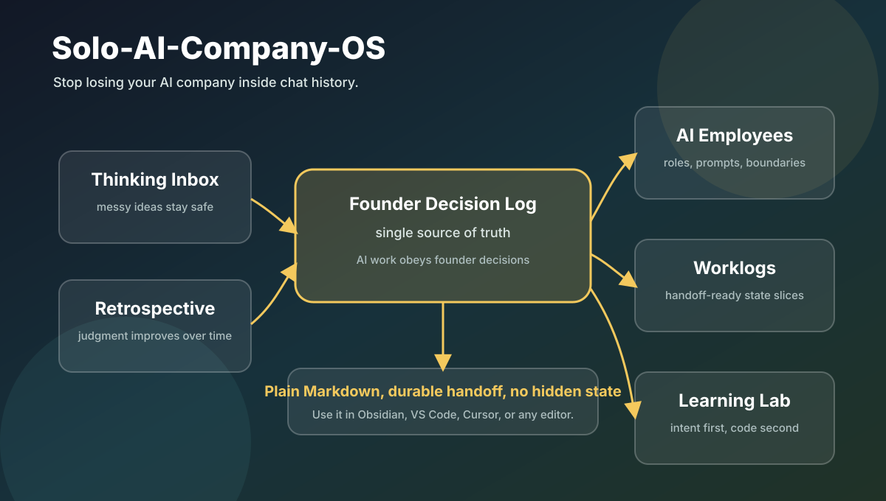

# Solo-AI-Company-OS

**Stop losing your AI company inside chat history.**

A disciplined Markdown operating system for solo founders managing AI employees.

Solo-AI-Company-OS helps you turn scattered AI chats into founder decisions, role-based AI operators, durable worklogs, handoffs, and a learning loop you can actually trust.

This is not a prompt dump. It is an operating system for memory, delegation, review, and founder judgment.



---

## At A Glance

| If your AI work feels like... | This gives you... |
|---|---|
| decisions buried in old chats | a formal founder decision log |
| every AI chat starting cold | stable role prompts and read-before-work files |
| progress reports that vanish | handoff-capable worklogs |
| strategy mixed with messy thinking | separate inbox, decision, and retrospective ledgers |
| the founder losing technical confidence | a learning lab with AI-05 as tutor |

The system is intentionally boring in the best way: plain files, explicit rules, durable handoff, and no hidden platform dependency.

---

## Who Is This For?

- **Solo founders and indie hackers** building complex products with AI.
- **Researchers and consultants** managing multiple AI context windows.
- **Non-technical founders** using AI to understand codebases and technical systems.
- **Operators** who need AI work to leave a durable trail instead of disappearing into chat history.

Optimized for Obsidian MOC navigation, but fundamentally just Markdown. You can use it in Obsidian, VS Code, Cursor, or any editor.

Use this if you want a lightweight company memory system before you build heavier tooling.

Do not use this if you want an auto-running agent platform, a task app clone, or a set of one-off prompts.

---

## 15-Minute Quickstart

Do not overthink the architecture. Start with one AI employee and one worklog.

Optional self-serve setup:

```powershell
powershell -ExecutionPolicy Bypass -File .\scripts\init-vault.ps1 `
  -OutputPath 'F:\Your-New-Vault' `
  -CompanyName 'Your Company' `
  -FounderName 'Your Name' `
  -ProjectName 'Your Project' `
  -ProductName 'Your Product' `
  -CreateDay1Worklog
```

Or set it up manually:

1. **Open the vault**
   Open this folder in Obsidian, VS Code, Cursor, or any Markdown editor.

2. **Claim the system**
   Open `FOUNDER_START_HERE.md` and replace `[Company Name]`, `[Project Name]`, and `[Product Name]`.

3. **Write your first founder decision**
   Open `01_Founder/FOUNDER_Decision_Log.md` and create:
   `DEC-YYYYMMDD-001 - Establish AI Operating Boundaries`.

4. **Hire AI-01**
   Open `03_Company/AI_Employees/AI-01_Founder_Office/START_PROMPT.md`, copy the prompt, and paste it into your LLM chat.

   AI-01 coordinates. It does not make founder decisions.

5. **Create the first worklog**
   After AI-01 gives you priorities, save the result using:
   `03_Company/AI_Worklogs/WORKLOG_TEMPLATE.md`.

You now have durable company memory. Welcome to Day 1.

Want to see the shape before filling your own vault? Open `EXAMPLE_DAY_1.md`.

---

## Why This Exists

Solo founders using AI often run into the same problems:

- important decisions disappear inside chat history
- multiple AI windows lose context or duplicate work
- AI outputs get confused with founder decisions
- market ambition contaminates project truth
- the founder becomes less able to understand the system they are building

Solo-AI-Company-OS solves this by turning a Markdown vault into a lightweight company memory system.

The central principle is simple:

```text
The founder makes decisions. AI employees execute, document, review, and teach.
```

---

## The Five Pillars

### 1. Founder Decision And Thinking System

The founder has three separate ledgers:

- `01_Founder/FOUNDER_Thinking_Inbox.md` for raw thoughts, worries, ideas, and unresolved questions
- `01_Founder/FOUNDER_Decision_Log.md` for formal decisions that AI employees must obey
- `01_Founder/FOUNDER_Retrospective_Log.md` for daily or weekly reflection

Raw thinking is allowed to be messy. Formal decisions are structured, dated, and reviewable. Retrospectives convert experience into better future decisions.

### 2. AI Accountability And Data Retention

AI workers are treated like employees with roles, boundaries, start prompts, and worklogs.

Each AI employee has:

- `ROLE.md`
- `START_PROMPT.md`
- explicit responsibilities
- prohibited actions
- required read-before-work files
- required end-of-task reporting

Every completed task must leave enough context for the next AI to continue without guessing.

### 3. Project Learning Lab

The founder gets a dedicated learning area, not mixed with production work.

The learning style is:

```text
Architectural Intent First, Code Deconstruction Second.
```

AI-05 teaches why a module exists, where it fits, what risk it controls, and only then how the critical-path code works.

### 4. Company State And Project Truth Separation

Company materials may summarize verified truth, but they cannot replace it.

Use this generic project truth chain:

```text
[Data Capture Component] -> [Integrity Verification] -> [Analytical Output]
```

Market-facing language must stay downstream of verified project truth.

### 5. Obsidian MOC Navigation

The vault uses Map of Content files as navigation hubs.

`OBSIDIAN_HOME.md` is the front door. MOC files connect:

- founder decisions
- AI employees
- company operations
- project evidence
- demo assets
- account workspaces
- learning lab

The goal is to avoid folder-tree wandering. Both the human founder and AI context windows start from stable entry points.

---

## Default AI Team

| AI | Role | Responsibility |
|---|---|---|
| AI-01 | Founder Office / PMO | Priorities, routing, dashboards, state discipline |
| AI-02 | Builder / Evidence Owner | Project truth, verification, implementation quality |
| AI-03 | Growth / Revenue | Customers, outreach, offers, pipeline |
| AI-04 | Research / Risk | Claim boundaries, sensitive language, review |
| AI-05 | Learning Tutor | Founder learning, architecture explanation, homework review |

---

## Daily Operating Loop

1. Open `OBSIDIAN_HOME.md`.
2. Read `01_Founder/FOUNDER_Decision_Log.md`.
3. Ask AI-01 for the top priorities and blockers.
4. Open only the AI employee needed for the task.
5. The AI reads its role, prompt, dashboards, and worklog index.
6. The AI completes the task and writes a worklog.
7. AI-01 updates company state and coordination.
8. The founder records new decisions or retrospective notes.

---

## What This Is Not

This project is not:

- a backend application
- a customer relationship manager
- a legal compliance system
- a replacement for founder judgment
- a collection of generic prompts

It is a structured Markdown operating system for running AI-assisted work with discipline.

---

## After Day 1

Once the quickstart is working:

1. Open `OBSIDIAN_HOME.md` as the stable front door. Do not rename it.
2. Customize the AI employee roles under `03_Company/AI_Employees/`.
3. Use `03_Company/AI_Worklogs/WORKLOG_INDEX.md` to track durable work history.
4. Use `04_Learning/` when the founder needs to understand architecture or code.
5. Review `00_System_Brain/V2_Cognitive_OS_Roadmap.md` only after v1 is already useful.

---

## Example And Launch Files

- `CODEX_RESTART_PROMPT.md` lets a fresh Codex session recover project context after reinstall.
- `EXAMPLE_DAY_1.md` shows a fully fake first day inside the system.
- `CONTRIBUTING.md` defines what kinds of open-source contributions fit this project.
- `LAUNCH_PLAYBOOK.md` captures the recommended public launch and monetization path.
- `PRODUCT_BOUNDARY.md` defines the free Core and future Pro Pack boundary.
- `PROJECT_STATUS.md` tracks maintainer-facing release progress without changing reusable template files.
- `RELEASE_CHECKLIST.md` defines the validation and packaging flow before public release.
- `scripts/init-vault.ps1` generates a customized vault without paid tools or network calls.
- `scripts/validate-release.ps1` and `scripts/package-release.ps1` support self-serve release checks and ZIP packaging.
- `LICENSE` makes the core template usable, forkable, and remixable.

---

## Core Rule

When AI output conflicts with the founder's latest explicit decision, the founder decision log wins.

When market ambition conflicts with verified project truth, verified truth wins.
