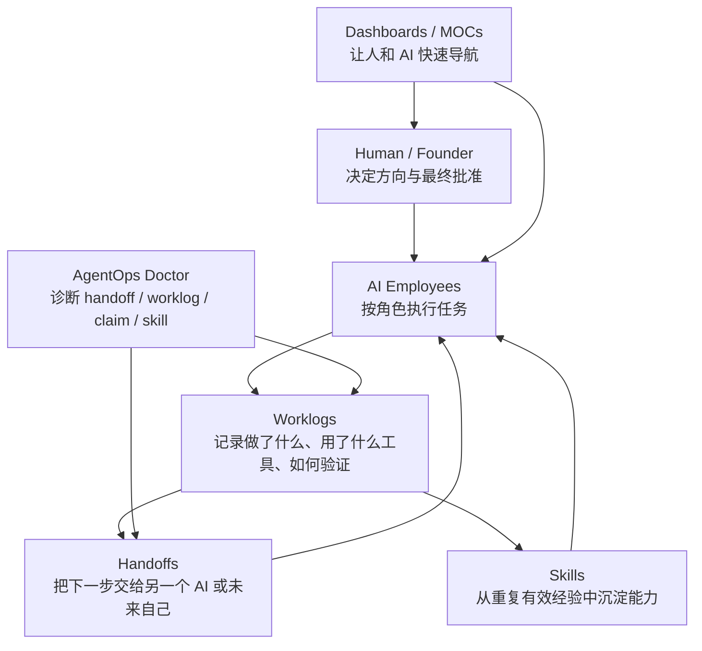

# Solo-AI-Company-OS 一页纸图解

## 核心循环

```text
Human decides.
AI executes.
Worklogs remember.
Handoffs coordinate.
Skills evolve.
Markdown stays source of truth.
```

## 系统图



## 三个入口

| 入口 | 解决什么 |
|---|---|
| AI 员工派工台 | 今天该找哪个 AI，复制哪段启动词，结束写什么 |
| AgentOps Doctor | 多 Agent 系统卡住、重复、脏状态、越界 claim 怎么诊断 |
| 一页纸架构 | 看懂 OS 的母体结构 |

## 五个核心对象

| 对象 | 人话解释 |
|---|---|
| Human | 人类决定方向、边界和最终批准 |
| AI Employees | 可复用的 AI 工作身份 |
| Worklogs | AI 工作的持久记忆 |
| Handoffs | AI 之间或跨会话的接力协议 |
| Skills | 从验证过的经验中提炼出的可复用能力 |

## 最小使用方式

```text
打开 Home
-> 进入 AI 员工派工台
-> 选一个 AI
-> 执行一个任务
-> 写 worklog
-> 有问题用 AgentOps Doctor
```

第一天不需要学完整架构。先跑通一个循环。
