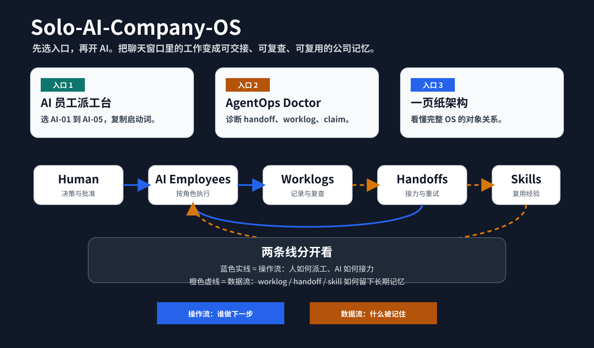

# Solo-AI-Company-OS 中文首页

> 一个用 Markdown / Obsidian 管理 AI 员工、决策、worklog、handoff 和 skill 的一人公司操作系统。



如果你觉得这个项目像论文，先别读架构。按下面三条路走。

## 三个入口

| 你想做什么 | 打开哪里 |
|---|---|
| 第一天只想快速跑通 | [Day-1 中文用户路径](DAY_1_CHINESE_USER_PATH.md) |
| 开始管理 AI 员工 | [AI 员工派工台](../../03_Company/AI_Employees/AI_EMPLOYEE_COMMAND_CENTER.md) |
| 给 Agent / Worklog 做体检 | [AgentOps Doctor](../../agentops-doctor/README.zh-CN.md) |
| 理解完整系统 | [一页纸图解](ONE_PAGE_VISUAL_GUIDE.md) |

---

## 这个系统解决什么

真实使用 AI 做项目时，问题通常不是“AI 不够聪明”，而是：

- 决策散在聊天记录里；
- 多个 AI 窗口互相不知道对方做过什么；
- 进展没有 worklog，下一次只能重新解释；
- 有用的方法没有沉淀成 skill；
- 公开输出里的 claim 没有证据边界。

Solo-AI-Company-OS 用 Markdown 文件把这些东西接住。

```text
人做决策。
AI 做执行。
Worklog 留下记忆。
Handoff 协调接力。
Skill 复用经验。
Markdown 是唯一真相来源。
```

---

## 第一次只跑一个小闭环

不要填完整个 vault。第一次只做：

1. 写一条正式决策或任务目标。
2. 从 [AI 员工派工台](../../03_Company/AI_Employees/AI_EMPLOYEE_COMMAND_CENTER.md) 选一个 AI。
3. 复制对应 `START_PROMPT.md` 到聊天窗口。
4. 任务结束后，用 `scripts/new-worklog.ps1` 生成一条 worklog 草稿。

这四步跑通，系统就已经开始工作。

---

## 推荐阅读顺序

1. [从这里开始](START_HERE.md)
2. [Day-1 中文用户路径](DAY_1_CHINESE_USER_PATH.md)
3. [快速上手](QUICKSTART.md)
4. [第一次运行示例](FIRST_RUN_EXAMPLE.md)
5. [核心术语表](GLOSSARY.md)
6. [为什么这不是 prompt collection](WHY_THIS_EXISTS.md)
7. [黑客松展示故事](HACKATHON_STORY.md)

英文根目录 README 负责 GitHub 国际传播；中文文档负责中国现场和日常使用。
